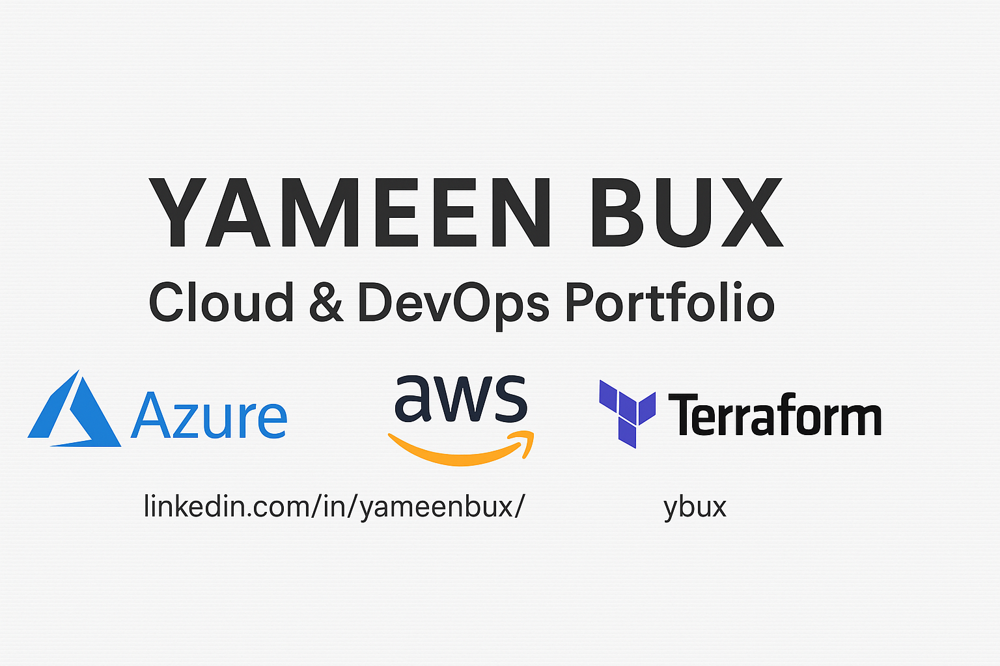

# 👋 Hi, I'm Yameen Bux

A Senior IT Infrastructure Engineer on a journey to becoming a Cloud & DevOps Engineer

I'm building hands-on expertise in:
- ☁️ Cloud Platforms – **Azure** (certified), learning **AWS**
- 🧱 Infrastructure as Code – **Terraform**
- 🔧 Automation – **PowerShell**, **Azure CLI**
- 🔄 CI/CD – GitHub Actions (in progress)
- 📦 Containerisation – **Kubernetes** (in progress)
---

## 🎯 My Goals

- 🔓 Transition into **cloud**
- 🧠 Prove my capabilities with real, hands-on cloud work

---

## 📫 Let's Connect

- 💼 [LinkedIn – Yameen Bux](https://www.linkedin.com/in/yameenbux/)
- 🌐 [GitHub – @yameenbux](https://github.com/yameenbux)
